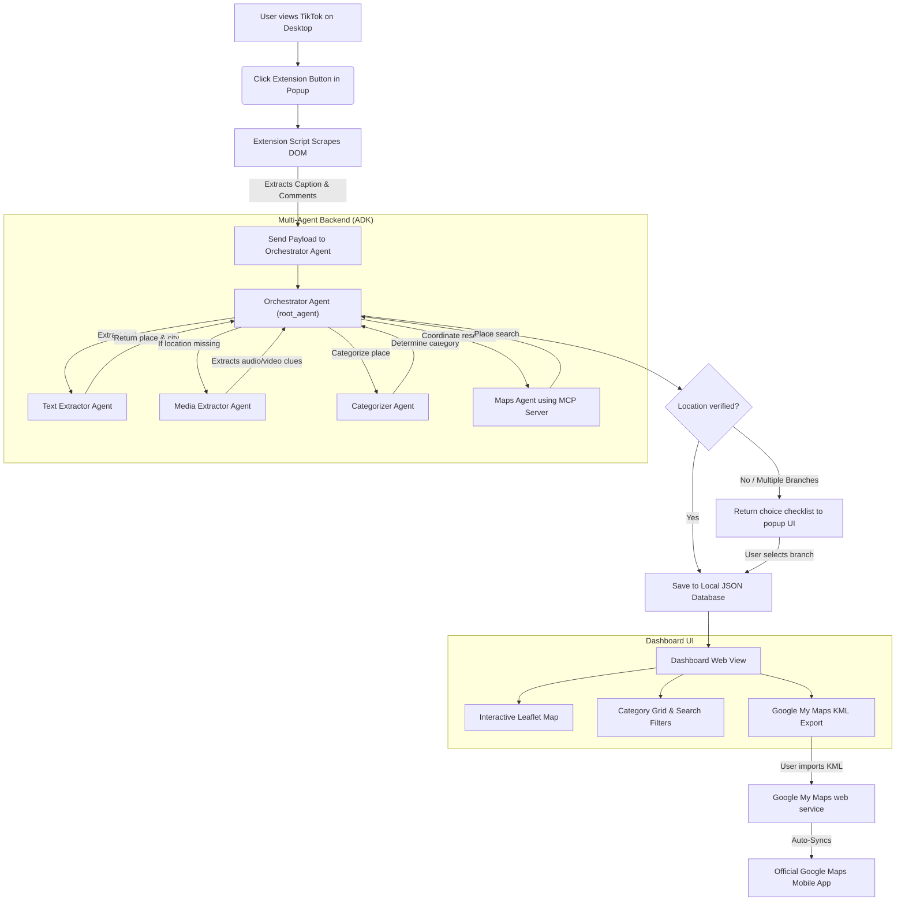

# TikTok-to-Google-Maps Location Saver

A secure travel concierge application that automatically extracts location recommendations from TikTok videos and comments, resolving coordinates via mapping APIs, and exporting them directly to your personal Google My Maps.

Built as a submission for the Google x Kaggle AI Course Capstone Project.

---

## 📋 Table of Contents
1. [Key Course Concepts Demonstrated](#-key-course-concepts-demonstrated)
2. [Problem Statement](#-problem-statement)
3. [Proposed Solution](#-proposed-solution)
4. [Architecture & Workflow](#-architecture--workflow)
5. [Multi-Agent Collaboration Loop](#-multi-agent-collaboration-loop)
6. [Setup & Running Instructions](#-setup--running-instructions)
7. [Verification & Testing](#-verification--testing)

---

## 🎓 Key Course Concepts Demonstrated

This project explicitly implements and showcases **five (5) core concepts** from the Google x Kaggle AI Course:

1. **Multi-Agent Systems (ADK)**: We construct a root **Orchestrator Agent** that dynamically delegates sub-tasks to four specialized sub-agents (`text_extractor_agent`, `media_extractor_agent`, `categorizer_agent`, and `maps_agent`) using Google's Agent Development Kit (ADK).
2. **Model Context Protocol (MCP)**: Our maps sub-agent integrates the official `@modelcontextprotocol/server-google-maps` server using ADK's native `McpToolset` to interface with the Google Maps API.
3. **Agent Skills (Agents CLI)**: We designed project-scoped agent skills (`google_maps_saver_skill`, `multimodal_extractor_skill`) with dedicated `SKILL.md` instructions and run evaluation checks via the `agents-cli` framework.
4. **Security & Privacy Gateways**:
   * *PII Redaction*: Programmatic regex filters scrub emails and phone numbers before forwarding text to the LLM.
   * *Injection Shield*: AI extraction is decoupled from execution. The LLM only parses raw text to JSON, while database writes are handled by immutable Python backend code.
5. **Human-in-the-Loop Loop**: The popup UI features a 10-second countdown undo bar and a branch selection checklist to let users review and correct the agent's decisions.

---

## 🚨 Problem Statement

Every day, travelers and food enthusiasts discover locations on TikTok. However, capturing these locations is a manual, tedious process:
* **Unstructured Captions**: Descriptions contain colloquial nicknames or slang rather than clear addresses.
* **ambiguity**: Videos often mention businesses with multiple branches (e.g. multiple "Joe's Pizza" locations in NYC), requiring manual selection.
* **Privacy Exposure**: Social media comments contain user PII (emails, phone numbers) that shouldn't leak to public AI trace logs.

---

## 💡 Proposed Solution

The **TikTok-to-Google-Maps Location Saver** bridges the gap between social media discovery and physical travel utility:
1. **Asynchronous Scraping**: A Manifest V3 Chrome Extension scrapes captions and comments from active TikTok tabs.
2. **PII Scrubbing Gateway**: Regex filters redact personal emails, phone numbers, and keys before payloads hit the LLM.
3. **Multi-Agent Pipeline**: Specialized ADK sub-agents extract place names, categorize them, and query mapping coordinates.
4. **Interactive Map Dashboard**: A standalone Leaflet.js dashboard plots your saved pins color-coded by category.
5. **My Maps Sync**: Downloads styled KML files with pre-colored folder layers for one-click import into Google My Maps.

---

## 📐 Architecture & Workflow

Below is the end-to-end data flow from the Chrome Extension trigger to local storage and Google Maps sync:



---

## 🤖 Multi-Agent Collaboration Loop

Our backend coordinates five specialized sub-agents using a **text-first priority and fallback loop**:

1. **Text Priority**: The **Orchestrator Agent** starts by delegating the scraped TikTok caption and comment text to the **Text Extractor Agent**.
2. **Multimodal Fallback**: If the text extraction yields no places (e.g., the creator didn't write the location in the caption), the Orchestrator falls back to the **Media Extractor Agent** to transcribe audio speech and run OCR on key video frames.
3. **Semantic Categorization**: Once a location name is successfully extracted, the Orchestrator hands it to the **Categorizer Agent** to classify it as *Food*, *Shopping*, or *Sightseeing*.
4. **MCP Resolution**: Finally, the Orchestrator invokes the **Maps Agent** via the Google Maps MCP Server tools to look up coordinates and Place IDs, formatting the final result for the database.

---

## 🚀 Setup & Running Instructions

### Prerequisites
* **Python 3.13**
* **uv**: Python package manager and runner - [Install Guide](https://docs.astral.sh/uv/getting-started/installation/)
* **Google AI Studio API Key** - [Get API Key](https://aistudio.google.com/app/api-keys)

---

### Step 1: Start the Backend FastAPI Server
1. Clone this repository and navigate to the `agent` folder:
   ```bash
   cd agent
   ```
2. Configure your credentials by creating or editing `app/.env` and pasting your key:
   ```env
   GOOGLE_API_KEY=YOUR_API_KEY_HERE
   ```
3. Start the FastAPI server (this will automatically configure dependencies and boot the server):
   ```bash
   uv run python -m app.fast_api_app
   ```
   * The server runs on `http://localhost:8000`.
   * The visual dashboard is accessible at `http://localhost:8000/dashboard`.

---

### Step 2: Load the Chrome Extension
1. Open Google Chrome and navigate to `chrome://extensions/`.
2. Toggle **Developer mode** on in the top-right corner.
3. Click **Load unpacked** in the top-left corner.
4. Select the `extension/` folder in your project root:
   ```text
   tiktok-location-saver/extension/
   ```

---

## 🧪 Verification & Testing

### Running Mock Test Suite
To verify the extraction logic, classification routing, and coordinate resolution without consuming Gemini API quota, run the mock unit test suite:
```bash
cd agent
uv run pytest tests/unit/test_fast_api_mock.py
```
All tests should pass cleanly (`2 passed`).
